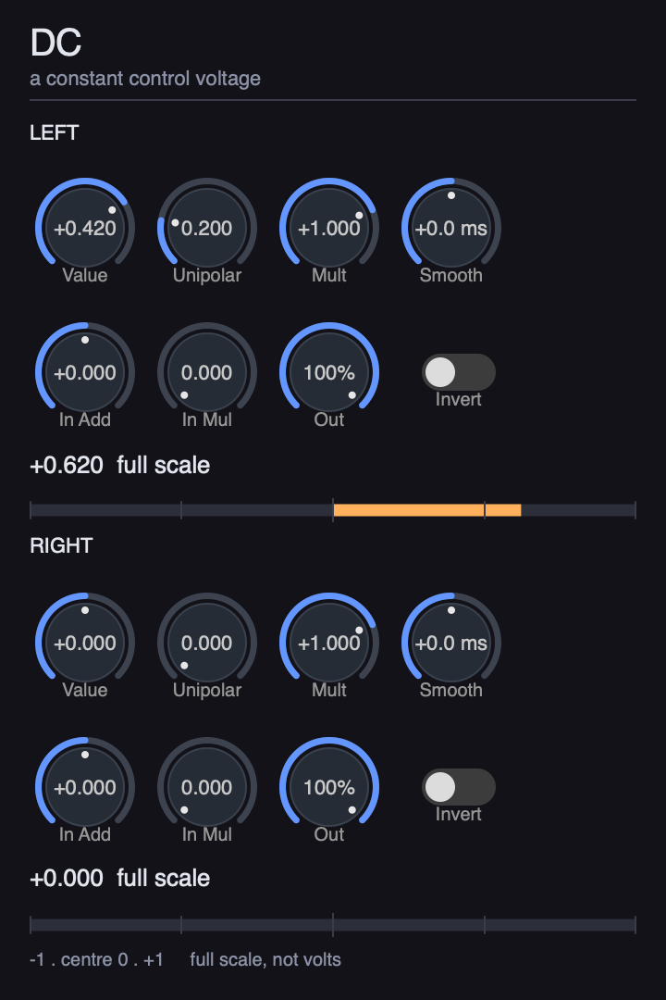
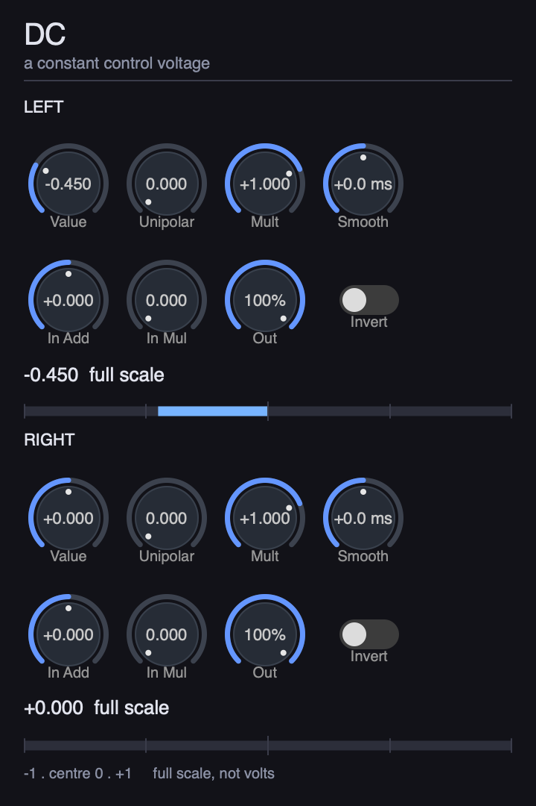
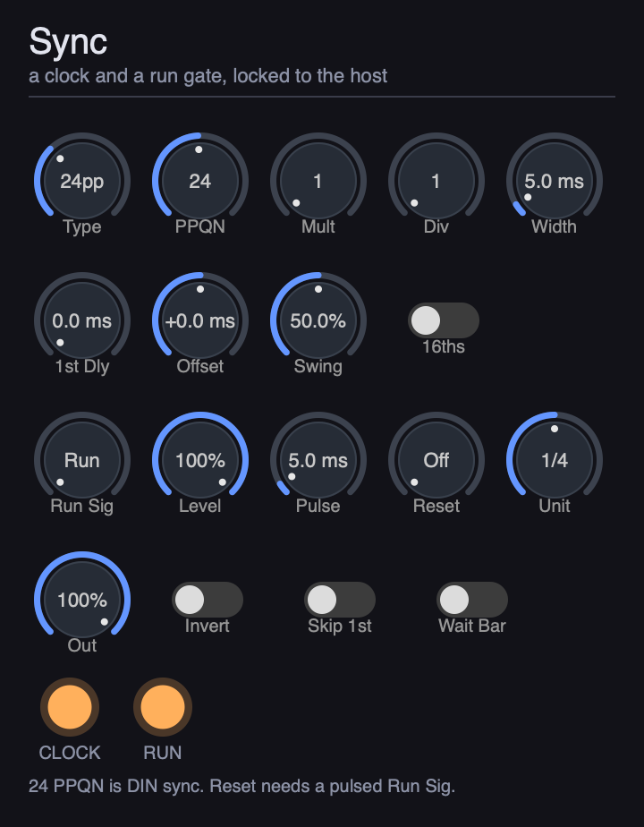
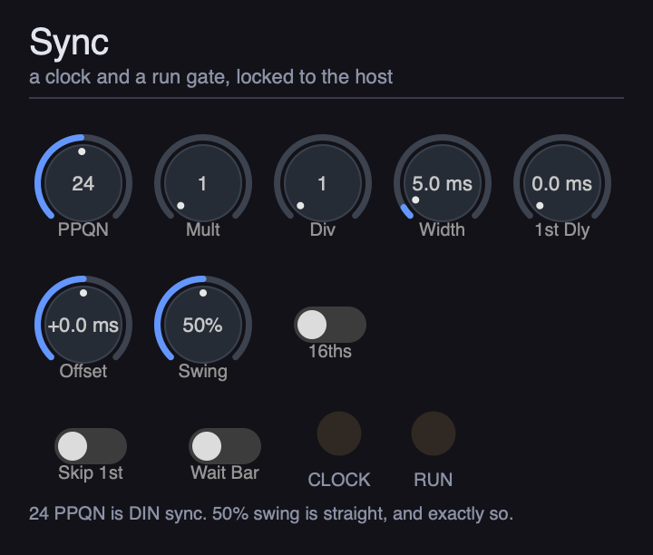
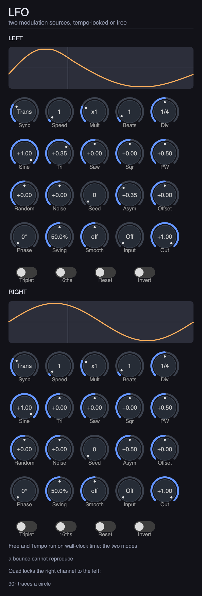
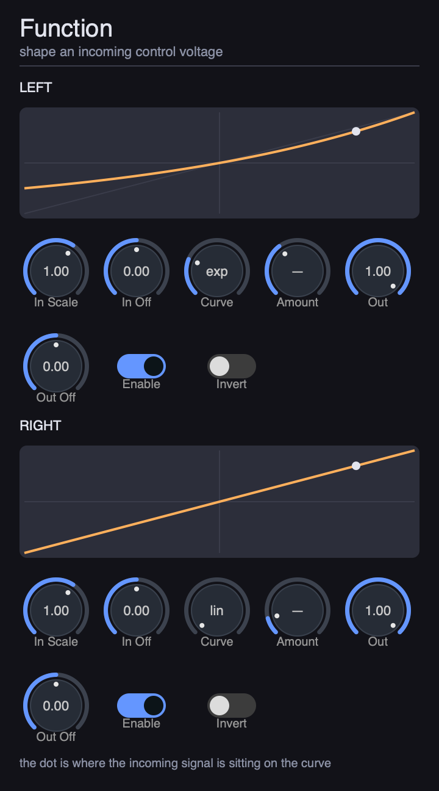
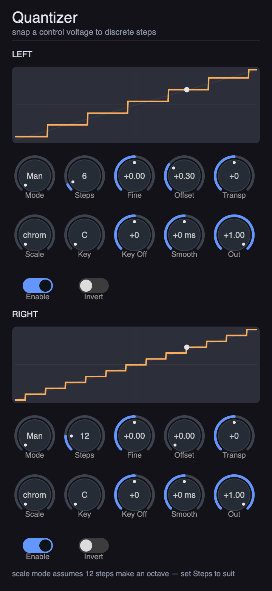
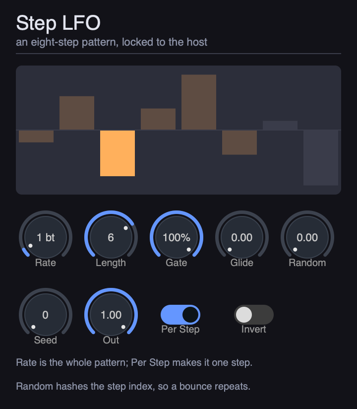
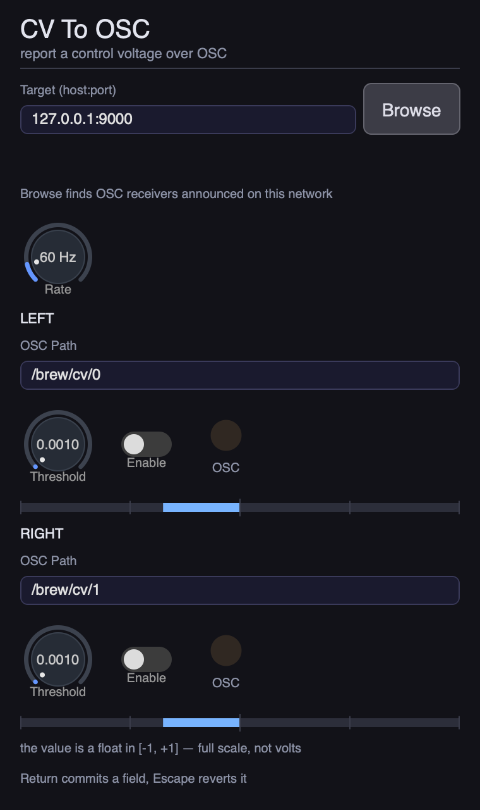

# Bitches Brew

Control-voltage plug-ins. They emit DC and audio-rate signals meant for the CV
inputs of an analog modular synth, reached through a **DC-coupled** audio
interface (optionally via ADAT to a DC-coupled expander).

MIT, like the rest of Pulp. No registration, no activation, no phone-home.

## Why a plug-in can be a voltage source

An audio interface converts sample values to a voltage. Most interfaces
AC-couple their outputs, high-passing away anything near 0 Hz — so a constant
sample value decays to nothing at the jack. A **DC-coupled** output does not,
which means a steady sample value is a steady voltage, and a plug-in that writes
`0.5` to every sample is a plug-in that holds half of full scale at the jack.

That is the whole trick, and it is also why these plug-ins are unusually strict
about signal integrity. Anything that would be inaudible in an audio path —
smoothing a parameter change behind the user's back, dithering, a DC-blocking
filter, a host deciding a buffer is "silent" and substituting zeros — is a wrong
voltage here.

The rule is *nothing smooths unless you asked*, not *nothing smooths*. An
explicit slew control is a portamento, and a modular has slew limiters in it for
exactly that reason. DC has one, off by default; at zero it is a wire, and the
bit-exactness tests still hold.

## Output convention

Samples are **normalized full-scale in `[-1, +1]`**. A plug-in never knows about
volts: full-scale voltage is a property of the interface, and differs between
devices and sometimes between outputs on one device. Each plug-in exposes
`Output Scale` and `Invert` as per-instance calibration (some interfaces wire
their outputs with reversed polarity; without `Invert` the suite is unusable on
them).

## Plug-ins

| Name | What it does |
|------|--------------|
| `DC` | Holds one constant value, optionally shaped by the input and slewed. The connection tester, and the suite's bit-exactness guard. |
| `Sync` | A clock pulse train and a run/stop gate, locked to the host transport. |
| `LFO` | Two modulation sources, each locked to the tempo or free-running in hertz, in one of eight sync modes. |
| `Function` | Math on an incoming control voltage: a curve, plus scale and offset at each end. |
| `Quantizer` | Snaps an incoming control voltage to discrete steps, or to the notes of a scale. |
| `Step LFO` | An eight-step pattern and a gate, locked to the host. |
| `CV To OSC` | Passes a control voltage through and reports it over OSC to a target you type. Off by default. |

`Function` is the only plug-in here that reads its input bus — the others
generate. It offers five curves, and they are not all the same kind of thing.

`Linear`, `Exponential` (`2^x - 1`), `Logarithm` (`1 + log2(x)`, zero for
non-positive input) and `Absolute` are the conventional definitions, and they are
the defaults, because a patch written against any other CV utility expects them.
They are also poorly behaved on a bipolar signal, and honestly so: `2^x - 1` is
not odd-symmetric, so it shifts the centre of a symmetric LFO; and the logarithm
is undefined below zero, so it flattens half the range and dives toward negative
infinity near the origin, where the output clamp catches it. Those are properties
of the functions, not of this implementation.

`Power` is ours: `y = sign(x) · |x|^k`, the obvious single-parameter family for a
bipolar signal. Odd-symmetric, so polarity survives. Monotone, so it never folds.
Fixed at the origin and both rails for every `k`, so `Amount` bends the middle of
the response without ever moving where full scale lands. And `k` and `1/k` are
exact inverses, so one knob spans both directions. Reach for it when the signal
swings both ways; reach for the conventional pair when you are reproducing
someone else's patch. `Amount` drives `Power` and nothing else — the editor shows
a dash on the other curves rather than a stale number.

Two consequences worth naming. Its defaults are a **bit-exact wire**, so a
freshly inserted Function can never be the thing that changed a voltage. And its
bypass is a **wire, not a mute** — the opposite of the generators, because muting
an insert would drop the voltage the plug-in *upstream* of it is generating.

`LFO` is a **mixer, not a selector**. Sine, triangle, saw and square each have
their own bipolar depth and are summed, so a shape can be subtracted as easily as
added and everything between the four is reachable. One depth at full and the rest
at zero is the single-shape behaviour you would expect. `Asymmetry` moves the
waveform's centre in time — a pulse-width control generalized to every shape — and
`Random` is a sample-and-hold, one level per cycle held flat across it.

The sum is not clamped inside the mixer. The depths at full reach past the rail,
and flattening that before `Offset` and the output scale have had their say would
silently discard a mix you asked for. It clamps once, at the jack.

`Smooth` is the one control here that carries state, and it is off by default for
that reason. At zero it is a wire, bit for bit. Turned up it slews (positive) or
low-passes (negative) the shape before the output stage, exactly as `DC`'s does —
which means a bounce from a fixed start is still identical every render, but a
locate into the middle of a project agrees with a playthrough only after the
smoother has settled. That transient is bounded by the time constant you dialled
in, and it is the honest price of a slew limiter on a generator.

`Swing` warps the beat timeline the same way `Sync`'s does, and for the same
reason it is applied to the *position* before the position becomes a phase: warp
the phase afterwards and the LFO stops agreeing with the clock it is supposed to
shuffle alongside. 50% is straight, bit-identically so. It has no meaning in a
hertz mode — a hertz rate that shuffled would just be a wrong hertz rate — so it is
ignored there rather than approximated, and it only applies while the transport
plays.

The LFO's phase is derived from the host's position rather than accumulated per
block, so a bounce lands the modulation on the same samples every time, a locate
puts the LFO where the timeline says it should be, and a long session cannot drift
against the host. The `Random` level is a **hash of the cycle index** and `Noise` a
**hash of the sample index**, not generators, for exactly that reason: render
twice, get the same samples. Reroll them with `Seed`, not by pressing play again.
Rendered per sample: a block-rate control voltage is an audible zipper on whatever
it drives.

Two of the LFO's eight sync modes are the exception, and the editor names them.
`Free` and `Tempo` keep oscillating while the transport is parked, which is not a
function of a position that is not moving — so those two, and only those two, do
not bounce bit-identically. `Free3` is what a position-derived "free run" actually
is, and it is exact.

`Sync` also carries a **1st Delay** (hold the clock off for N ms after the
transport starts, measured from the run origin so two runs behave identically)
and a bipolar **Offset**. The offset exists because a DAC, its reconstruction
filter, and the receiving gate input all add latency: a clock that is
sample-accurate in software arrives late at the hardware, and a negative offset
pulls the pulses back ahead of the beat.

FSK tape sync is **not implemented**. It needs a continuous phase accumulator
designed rather than bolted on, and nothing in this suite accumulates phase.

Built for VST3, AU, and CLAP. The AU component type follows the descriptor: `aufx`
for the plug-ins that take no MIDI, `aumf` for `LFO`, whose `Reset` retriggers on a
note-on — an AU host routes MIDI only to a `MusicEffect`. `brew-core/` holds what
the plug-ins share: the output stage above, the clock grid, the pulse-width rules,
the scales, and the run-segment origin. `brew-ui/` holds the shared editor
furniture.

## The plug-ins, one at a time

Every screenshot below is rendered headlessly from the real
`Processor::create_view()` path, at exactly the size the plug-in reports from
`editor_size()`. Regenerate them with
`examples/bitches-brew/docs/update-screenshots.sh` and commit the result
alongside any editor change.

Every control reads in **normalized full scale**, `[-1, +1]`. Nothing here knows
what a volt is.

### DC



A constant. It is the plug-in you patch first, because a constant is the only
signal whose correctness you can confirm with a multimeter.

`Value` sets a bipolar level and `Unipolar` a positive-only one; they are summed,
so you can park a bipolar modulation around a positive rest voltage without a
second plug-in. `Mult` scales that sum, which is what you automate when you have
drawn a shape you like and only want it louder.

`In Add` and `In Mul` fold the input bus in. `In Mul` at 1.0 makes the output the
constant multiplied by the input, so an envelope arriving on the input becomes an
envelope on the output; at 0.0 the input is ignored entirely. The multiply happens
before the add.

`Smooth` slews (positive milliseconds) or low-passes (negative), calibrated so
that the number is the time a full `-1` to `+1` swing takes. At zero it is a wire,
bit for bit.

The rail across the bottom shows the sample the DSP actually emitted — not the
value the knobs are asking for. Those differ whenever the input bus or the
smoother is doing anything, and the difference is exactly what you want to see.
Polarity is visible too: a negative value fills the other half of the rail.



### Sync



A clock, locked to the host transport. Channel 1 is the pulse train, channel 2 a
run/stop gate that is high while the transport plays.

`PPQN` is pulses per quarter note — 24 is DIN sync, which is what a TR-606 or a
Juno arpeggiator expects. `Mult` and `Div` scale that rate. `Width` sets the
pulse length in milliseconds; the pulse is a fixed length, not a duty cycle, so
the rate can change without the hardware seeing a different pulse.

`Offset` advances or delays the whole clock against the transport, in
milliseconds, which is how you compensate for a converter's latency or a
sequencer's slow opto-isolator.

`Swing` warps the beat timeline so that every second eighth (or sixteenth) lands
late. 50% is straight, and *exactly* straight: at 50% the output is bit-identical
to swing having never been touched. Swinging a clock swings whatever hardware is
following it, which is otherwise hard to arrange.

`Skip 1st` suppresses the pulse on the downbeat, and `Wait Bar` holds the clock
until the next bar line. `1st Dly` delays only the first pulse after the transport
starts, for a machine that needs a moment to arm.

The two lamps read real DSP state rather than the transport flag, so a dark CLOCK
lamp means no pulse was emitted — not merely that the host said it was stopped.
Stopped, then running:



### LFO



Two independent modulation sources, one per channel, with identical controls. Set
the right channel's `Sync` to `Quad` and give it a 90° `Phase` and it locks to the
left channel a quarter cycle ahead: patched into two CV inputs the pair traces a
circle, which is how one oscillator drives a two-axis modulation — a filter's
cutoff and its resonance, a panner's X and Y. The scope draws the leader faintly
behind the follower so the lock is visible rather than asserted.

It is a **mixer, not a selector**. `Sine`, `Tri`, `Saw` and `Sqr` each have their
own bipolar depth and are summed, so a shape can be subtracted as easily as added
and everything between the four is reachable. One at full and the rest at zero is
the single-shape behaviour you would expect.

`Sync` picks one of eight modes:

| Mode | Frequency | While stopped | While playing |
|---|---|---|---|
| `Free` | `Speed` × `Mult` | keeps running | keeps running |
| `Tempo` | `Beats` × `Div` | keeps running | keeps running |
| `Trans` | `Beats` × `Div` | keeps running | locked to the position |
| `Quad` | the other channel's | the other channel's | the other channel's, plus `Phase` |
| `St/Sp` | — | low | high |
| `Trans2` | `Beats` × `Div` | holds | locked to the position |
| `Free2` | `Speed` × `Mult` | holds | from the play edge |
| `Free3` | `Speed` × `Mult` | holds | from the timeline |

`Trans` is the default. `Beats` counts notes of the length `Div` names, a third
shorter with `Triplet` — `Div` at 1/8 with `Beats` at 3 is three eighth notes.
`Speed` × `Mult` is a rate in hertz across five decades. `Phase` offsets the cycle,
and is where a `Reset` retrigger snaps back to. `Asym` moves the waveform's centre
in time — a pulse-width control generalized to every shape — and `PW` is the square
component's own width.

`Random` is a sample-and-hold: one level per cycle, held flat across it. `Noise` is
the ungated source: a new level every sample. Both are hashes rather than running
generators — of the cycle index and the sample index respectively — so both survive
a bounce. Reroll them with `Seed`. `Offset` adds a constant; `Out` and `Invert` are
the per-instance calibration every plug-in here carries.

`Input` decides what the plug-in does with the voltage on its input bus: `Off`,
`Add`, `Mul`, or `Comb` (the sum of what `Add` and `Mul` would each have produced).
It is `Off` by default, for the same reason a bypassed generator is silent — a
modulation source that read its input by default would scream the first time it was
dropped on an audio track.

`Reset` retriggers the cycle to `Phase` on a MIDI note-on, at the note's own
sample. The plug-in is therefore an AU `aumf`, the only AU type a host routes MIDI
to.

`Swing` warps the beat timeline exactly as `Sync`'s does, so an LFO and a clock
shuffled together stay together, and — like the clock's — it only applies while the
transport plays. `Smooth` behaves as DC's.

The scope draws the unsmoothed shape — smoothing is a function of time, and the
scope is drawn in cycles.

### Function



The only plug-in here that exists to process an incoming voltage rather than
generate one. The knobs read left to right in the order the signal travels: scale
and offset the input, bend it through a curve, scale and offset the output.

`Curve` picks between `Linear`, `Exponential` (`2^x - 1`), `Logarithm`
(`1 + log2(x)`, zero below zero), `Absolute`, and `Power`. `Amount` is the
exponent of the `Power` curve and is ignored by the others, which is why it reads
as a dash when it does nothing.

The graph plots the whole transfer — input stage included — and the dot rides the
curve at the point the incoming signal is currently sitting on. Watching that dot
is how you tell a live CV from a dead cable in a host that shows you no meter.

### Quantizer



Snaps a continuous voltage to a staircase. It turns a smooth LFO into an arpeggio,
a portamento into a glissando, a random walk into a sequence.

`Steps` divides the full `[-1, +1]` range into that many equal treads, with `Fine`
added on for non-integer counts. `Offset` slides the lattice within a step, which
decides whether zero volts falls on a tread or between two. `Transpose` shifts the
chosen step by a whole number of steps — a *lattice* shift, not a voltage offset,
which is the only kind of transpose that keeps a quantized signal quantized.

The staircase is drawn from the same transfer function the DSP runs, with the
faint diagonal showing where the unquantized signal would have gone.

**Steps divide full scale, not an octave.** A semitone is a fixed voltage, and no
plug-in here knows what full scale is worth in volts, so twelve steps lands on
semitones only by coincidence. Calibrated pitch quantization needs a measured rail
and is not built.

### Step LFO



An eight-step pattern. Drag in the display to draw it. Channel 1 is the stepped
voltage, channel 2 a gate.

`Rate` means the whole pattern by default; `Per Step` reinterprets it as the time
of a single step. That is a real fork, not a preference: with `Rate` as the cycle,
shortening `Length` makes the steps faster and the pattern keeps its period — it
stays an LFO. With `Rate` as the step, the pattern's period grows with its length
— it becomes a sequencer.

`Gate` sets how much of each step carries its value; the rest of the step falls to
zero, on *both* the voltage and the gate. At the default of 100% nothing is punched
out and the gate never falls, which is right — with full-length steps there is no
gap between one note and the next to fall into. Turn it down and every step grows
a rising edge, which is what an envelope generator downstream needs in order to
fire once per step instead of once per phrase.

`Glide` slews from the previous step's level into the current one over the first
fraction of the step, so a step still spends most of its time at the level it was
programmed to. `Random` adds a bounded offset to each step, hashed from the
**absolute** step index — so the pattern's shape loops but its dither does not, and
the same project bounces to the same samples every time. `Seed` rerolls it.

### CV To OSC



Passes both channels through **bit-exactly** — it is a wire with a tap on it — and
reports what it sees over OSC. `Target` takes a `host:port` (a hostname, an IPv4
address, or a bracketed IPv6 literal), and each channel sends one float to its own
`OSC Path`. `Browse` lists the OSC receivers advertising themselves over mDNS;
clicking one fills in the target. Return commits a field, Escape reverts it, and a
target or a path the plug-in cannot use is refused rather than silently corrected —
an address pattern like `/cv/*` is a legal thing for a receiver to match against
and an illegal thing for a sender to put in a packet.

Both channels are `Enable`d off by default, because a plug-in that opens a socket
the moment it loads is a plug-in that surprises somebody. `Rate` caps how often
messages go out — one rate, because one background thread sends both channels — and
each channel's `Threshold` suppresses a message when its voltage has not moved by
at least that much. A change smaller than the threshold is noise, and flooding a
receiver with it helps nobody.

Each lamp lights when that channel's message actually left. The audio thread never
touches the socket: it stores one float per channel per block, and the sender runs
on its own clock.

## The editors exist because CV is invisible

A CV plug-in makes no sound and drives no meter, so from inside a DAW there is no
way to tell "holding +0.5 full scale" from "cable unplugged". Every plug-in
therefore shows what is actually leaving the jack: `DC` draws a bipolar rail with
a marker at its current output, `Sync` lights a CLOCK and a RUN lamp, `LFO` traces
its own output, and `Function` plots its curve with a dot at the point the signal
is currently sitting on it. The scope and the graph call the same `value_at()` and
`function_transfer()` the DSP does, so the picture cannot drift from the signal.
All four read real DSP state, published once per block from the audio thread.

The rail reads in **normalized full scale, never volts**. The plug-in cannot know
the interface's rail voltage, and printing a number it cannot know is a lie the
user would wire into a modular.

Controls are Pulp's own widgets, laid out with flex. `test_brew_ui.cpp` renders
each editor headless and asserts the readouts *move with the state* — a
screenshot test that only checks "the PNG is non-empty" passes on a blank canvas,
and on a plug-in this quiet a dead readout is indistinguishable from a dead cable.

Each plug-in overrides `editor_size()`, and both the test and the screenshot
dumper render at whatever it returns. Without the override a host opens the editor
at `Processor`'s 400×300 default, and a screenshot taken at any other geometry is
a picture of a layout no DAW will ever show.

## Nothing here has emitted a measured volt

The suite's correctness is covered by golden-vector tests. Its *hardware* claims
are covered by nothing at all, and this README will not pretend otherwise. A
sample value becoming a voltage, the polarity of that voltage, which host channel
arrives at which jack, whether a 1 ms trigger survives the DAC's reconstruction
filter — none of that is knowable from a datasheet, and none of it is verified.

`brew-rig` is the tool that closes what can be closed. Wire the interface's
outputs through the modular's CV inputs and back into its inputs, and it will
sweep one output channel at a time to discover the crossbar and the polarity of
the chain. It emits nothing without `--armed`, clamps its probe level to half
full scale, and writes zeros on every exit path including Ctrl-C — a CV tool that
leaves a voltage on a jack when it dies is worse than no tool.

What a loopback can never tell you is **volts**. A closed loop is dimensionless:
full-scale out arriving as full-scale in proves the chain is unity gain and
proves nothing about what was on the wire. `brew-rig hold` parks a DC level on
one channel so a meter or a scope can answer that, and until it is answered
nothing in this suite may print a voltage.

[HARDWARE.md](HARDWARE.md) is the bring-up procedure, the channel map established
so far, and the traps — each of which has already cost an hour.

## The clock is derived, never accumulated

`Sync` computes which clock edges fall inside a block from the host's reported
position. It does not advance a phase counter one block at a time.

This is the single most important decision in the suite. An accumulator has to
*catch up* whenever the host moves the playhead — and the audible result is a
burst of pulses at the instant the transport starts, arriving downstream as a
fistful of spurious clock ticks. Deriving from position means beat 3.7 maps to the
same edge regardless of how the playhead got there, so there is nothing to catch
up. `test_sync.cpp` asserts the exact multiset of edge offsets for ten transport
scenarios — play from the top, play from mid-timeline, stop/play cycles, loop
wrap, forward locate, tempo change, bar wait, a host re-rendering the same block,
a host lying about `transport_jump`, and no transport at all.

The features that genuinely *are* run-relative (skip the first pulse, wait for the
bar) hang off one explicit origin captured on the play edge. That is the whole of
the plug-in's musical state.

Two physical constraints bound the pulse width, and `Sync` clamps to both. A
one-sample pulse does not survive a DAC's reconstruction filter, so there is a
~1 ms floor. And a pulse as long as the clock period never falls — a welded gate —
so the width is held strictly under half the period. At 24 ppqn and 300 BPM the
period is 8.3 ms, which a perfectly reasonable-looking 10 ms trigger length would
weld. The ceiling wins when the two conflict: a weak trigger beats a stuck one.

## What is and isn't verified

`test_dc.cpp` proves that `Processor::process()` holds a value bit-exactly across
block sizes and sample rates, and that a fresh instance emits zero. `test_sync.cpp`
proves the clock's response to every transport scenario above. Those are real
guarantees, and they are not the whole chain.

Two links past it are **not** covered by these tests:

1. **A correct buffer can still be discarded by the host.** An adapter may hand
   the host the right samples flagged as silent, and the host will substitute
   zeros. That is a framework-level property, asserted at the adapter boundary
   in `test/test_au_v2_effect.cpp` and `test/test_vst3_plugin_state.cpp` (tagged
   `[silence]`), not here.

2. **A sample value becoming a real voltage needs hardware.** Nothing in this
   repo can measure a jack. Full-scale voltage, output polarity, DC coupling,
   and end-to-end latency are all unmeasured, and every claim that depends on
   them is open. The verification debt is tracked in the planning repo.

Do not describe these plug-ins as hardware-verified until that measurement
happens.

## Development

These are developed inside the Pulp tree against the live SDK, and are extracted
to their own public repo once the SDK changes they depend on ship in a release.

```bash
cmake --build build --target brew-core-test brew-dc-test brew-sync-test
./build/examples/bitches-brew/core/brew-core-test
./build/examples/bitches-brew/dc/brew-dc-test
./build/examples/bitches-brew/sync/brew-sync-test

cmake --build build --target BrewDC_VST3 BrewDC_CLAP BrewDC_AU
cmake --build build --target BrewSync_VST3 BrewSync_CLAP BrewSync_AU
```

## Provenance

Written from documented, observable behavior of DC-coupled CV workflows and from
public modular-synth conventions (1V/oct, DIN sync, gate/trigger levels). No
third-party plug-in's code, scripts, art, or binaries were consulted or copied.
