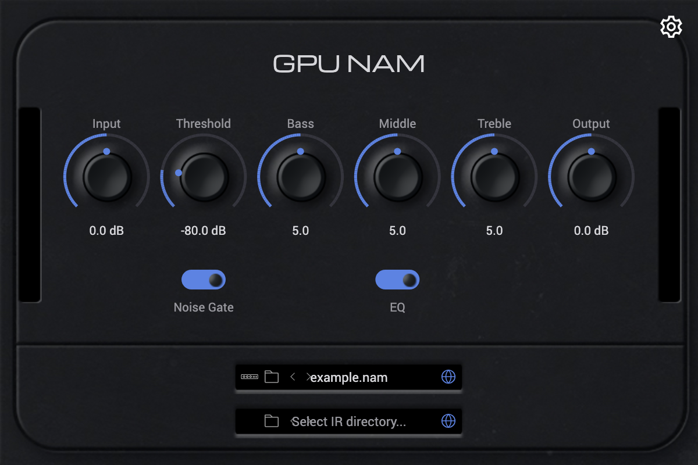

# GPU NAM

A Neural Amp Modeler **player** built on Pulp: it loads an open-source `.nam`
WaveNet capture and runs it through Pulp's GPU audio runtime, with an editor
rendered entirely on Pulp's view/canvas stack (Skia + Dawn).



## What it is

- **A `.nam` player, not a trainer.** Point it at a `.nam` capture (the open
  Neural Amp Modeler format) and it reproduces that amp/pedal. Training models is
  out of scope — use the [NAM trainer](https://github.com/sdatkinson/neural-amp-modeler).
- **CPU oracle by default; opt-in GPU engine.** The live path is the exact NAM
  WaveNet run inline on the audio thread (`nam_model.hpp`). Flipping the *Engine*
  control (in the settings gear) routes the same fixed 512-sample blocks through
  the real GPU audio runtime (`GpuNamCloudNode` on a `GpuAudioTransport`), which
  runs one fused `nam_forward` per channel on the GPU and is validated
  bit-for-bit against the CPU oracle. If no GPU device exists it stays on the CPU
  engine and always works.
- **Faithful DSP face.** Input → Noise Gate → NAM model → Bass/Middle/Treble tone
  stack → Output, with faithful control ranges (Input −20..20 dB, Threshold
  −100..0 dB, tone 0..10 with 5 = flat, Output −40..40 dB).

## The editor

The editor is a faithful recreation of
[NeuralAmpModelerPlugin](https://github.com/sdatkinson/NeuralAmpModelerPlugin)'s
face panel, rebuilt independently in Pulp's view/canvas (none of the plugin's
iPlug2/IGraphics UI code is used). The image and font assets are reused from that
MIT/OFL/Apache-licensed plugin under their own licenses — see
[`assets/nam/ATTRIBUTION.md`](assets/nam/ATTRIBUTION.md). The demo is titled
neutrally ("GPU NAM"); the "Neural Amp Modeler" name and wordmark are trademarks
and are not used as branding.

Because it is Pulp view/canvas, the editor is GPU-rendered (Skia Graphite on
Dawn) in a real host, and headless-renderable for tests and screenshots.

## Build & run

```bash
cmake -S . -B build -DPULP_ENABLE_GPU=ON
cmake --build build --target GpuNam_Standalone GpuNam_CLAP GpuNam_VST3 GpuNam_AU
```

Formats: VST3, AU, CLAP, Standalone. A default `example.nam` capture ships in the
bundle; load your own from the model slot.

## Tests

```bash
ctest --test-dir build -R gpu-nam
```

- `gpu-nam-test` / `gpu-nam-gpu-test` — the fused GPU WaveNet reproduces the CPU
  oracle (single block, streaming, and wins at scale).
- `gpu-nam-plugin-test` — CPU/GPU engines produce finite amped audio, bypass is
  the dry signal, the Engine switch is live at fixed latency, the noise gate
  attenuates sub-threshold signal, and the tone stack is transparent when flat.
- `gpu-nam-ui-test` — the editor renders non-blank and asset-composited, and
  pointer input drives real parameters.

## Released build

Signed/notarized binaries: <https://github.com/danielraffel/pulp-gpu-nam>.
